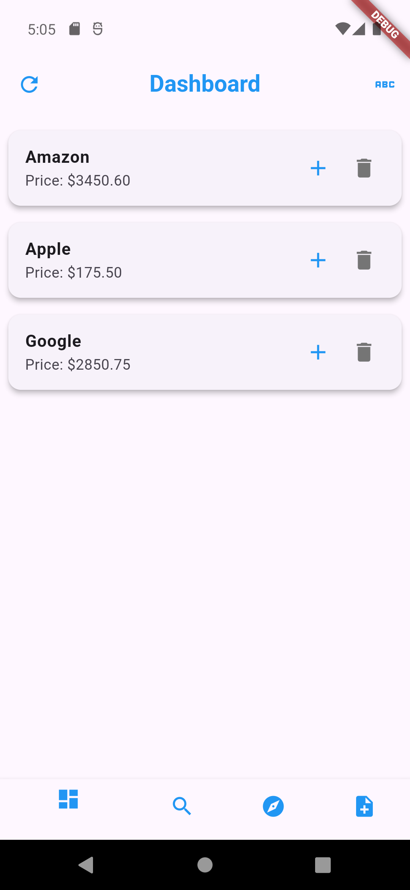

# Stock Dashboard & Journal App
A Flutter application for stock market exploration and journaling. Users can search for their favorite stocks and cryptocurrencies, add them to their favorites, and write notes on each one. The app dynamically updates the stock prices. 

## Installation
### Clone the Repository:
git clone https://github.com/your-username/your-repo.git
cd your-repo

### Install Dependencies:

flutter pub get

Run the App:

flutter run

I also added unit, widget, and integration tests. I used the Alpha Vantage RESTful API, so there is a strict limit of 25 calls per day. Just a fun project I was working on to learn Flutter/Dart. 
